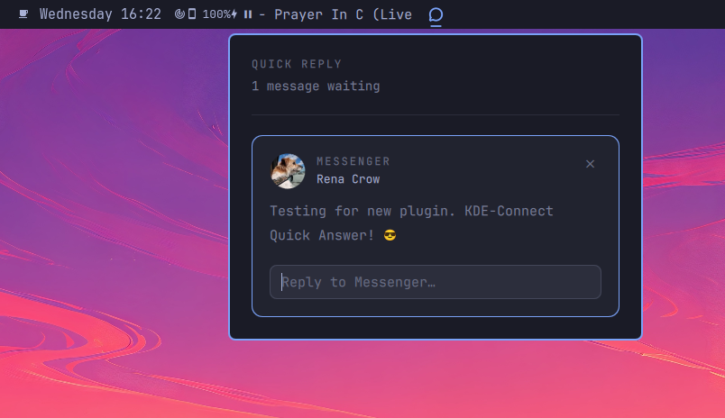

# Quick Reply

An [Omarchy](https://omarchy.org) shell bar widget that adds a **quick‑reply
channel** for repliable phone notifications relayed by KDE Connect — Messenger,
WhatsApp, SMS, Signal, … Type an answer straight from the bar and it goes back
to the conversation on your phone.



It does not touch Omarchy's normal notification stream. It is a second, separate
reader of the same source (KDE Connect's own D‑Bus objects) for one purpose:
answering. The bar icon appears **only while a message you can actually reply to
is waiting**, the way Omarchy's own status glyphs behave, and is gone again the
moment you reply or clear it.

## Why

KDE Connect mirrors phone notifications onto the freedesktop bus like any other
app — and that is all the notification spec can carry. KDE Connect *also* keeps
one object per notification on its own bus with the part the spec has no room
for: a `replyId` and a `sendReply` method. Omarchy shows the notification but
has no UI to use that reply channel. This widget is that UI.

## How it works

- **One bar icon**, present only while at least one repliable, whitelisted
  message is waiting. Nothing waiting → no icon.
- Click it → a panel listing each waiting message: sender photo, app, the text,
  and a reply field. Press **Enter** or **Send**.
- The reply goes out through KDE Connect's `sendReply`. Unless you turn it off,
  the notification is then `dismiss()`ed so it clears on the phone too and KDE
  Connect stops re‑forwarding it.
- A small **✕** on each card acknowledges a message without replying — it
  disappears from the panel immediately and is cleared on the phone as well.
- The list is driven straight off KDE Connect. An entry leaves when you reply,
  acknowledge it, or clear the notification on the phone. There is no host‑side
  cross‑reference (Omarchy's notification service exposes none to a plugin), so
  a message already read on the phone but not dismissed can linger until the
  next rescan (≤ 15 s, or instantly on any KDE Connect notification event).

## The whitelist

KDE Connect marks a **lot** of apps repliable — X, Claude, weather apps, … —
where sending a reply string is meaningless. A bar widget has no per‑message
config surface, so the gate is a plain **app whitelist**: only a notification
whose app matches the list ever produces the bar icon.

Settings live on the widget's entry in `~/.config/omarchy/shell.json` (edits
hot‑reload, no restart):

```json
{
  "id": "io.github.understackdev.quick-reply",
  "apps": "WhatsApp, Messenger, Signal, Telegram, Messages, Viestit, SMS, Instagram, Element",
  "dismissAfterReply": true,
  "alwaysShow": false
}
```

| Key | Default | Notes |
| --- | --- | --- |
| `apps` | `WhatsApp, Messenger, Signal, Telegram, Messages, Viestit, SMS, Instagram, Element, Google Messages, Samsung Messages` | Comma‑separated app names. Case‑insensitive, partial match both ways. **Empty string = allow every repliable app.** |
| `dismissAfterReply` | `true` | Call `dismiss()` after a successful reply. Only applies where KDE Connect marks the notification `dismissable`. |
| `alwaysShow` | `false` | Keep the bar slot even when nothing is waiting, so the bar centre never shifts. |

## Install

```sh
git clone https://github.com/UnderStackDev/omarchy_kdeconnect_quick_reply.git \
  ~/.config/omarchy/plugins/io.github.understackdev.quick-reply
```

Then in `~/.config/omarchy/shell.json` register the plugin and put it on the
bar (it renders as a zero‑width slot until a message is waiting, so `center`
next to the other status glyphs is a good home):

```json
{
  "plugins": [ { "id": "io.github.understackdev.quick-reply" } ],
  "bar": {
    "layout": {
      "center": [ "…", { "id": "io.github.understackdev.quick-reply" }, "…" ]
    }
  }
}
```

`omarchy restart shell` to pick up the new plugin. Later `shell.json` edits
(the whitelist, bar position) hot‑reload on their own.

### Updating

```sh
git -C ~/.config/omarchy/plugins/io.github.understackdev.quick-reply pull
omarchy restart shell
```

### Removing

```sh
omarchy plugin remove io.github.understackdev.quick-reply
```

…then drop its two `shell.json` entries and `omarchy restart shell`.

## Keybindings / scripting

```
omarchy-shell io.github.understackdev.quick-reply toggle       open / close the panel
omarchy-shell io.github.understackdev.quick-reply open
omarchy-shell io.github.understackdev.quick-reply close
omarchy-shell io.github.understackdev.quick-reply count        how many are waiting
omarchy-shell io.github.understackdev.quick-reply list         waiting messages, as JSON
omarchy-shell io.github.understackdev.quick-reply dismiss      acknowledge the newest, no reply
omarchy-shell io.github.understackdev.quick-reply dismissAll   acknowledge all of them
```

Example — in `~/.config/hypr/bindings.lua`:

```lua
o.bind("SUPER + ALT + M", "Quick reply", "omarchy-shell io.github.understackdev.quick-reply toggle")
```

## Requirements

- **Omarchy** with the Quickshell bar (`omarchy.bar`).
- **KDE Connect** running with a paired device — `kdeconnect-cli -l` to check.
  Without it there is nothing to read and the icon never appears.
- **`busctl`** (systemd) on `PATH` — used to enumerate notifications.
- **Python 3** with **python-gobject** (`gi` / GDBus) — `bin/qr-kdeconnect`
  makes the `sendReply` / `dismiss` D‑Bus calls in‑process so the reply text is
  never a subprocess argument. python-gobject ships with every GTK‑based
  desktop, Omarchy included.

## How it talks to KDE Connect

Service `org.kde.kdeconnect` on the **session** bus:

| Object | Interface | Used for |
| --- | --- | --- |
| `…/notifications/<leaf>` | `org.kde.kdeconnect.device.notifications.notification` | read `replyId` (non‑empty ⇒ repliable), `appName`, `title`, `ticker`, `text`, `dismissable`, `iconPath`; call `dismiss()` |
| `…/notifications` | `org.kde.kdeconnect.device.notifications` | call `sendReply(replyId, message)`; its `notification{Posted,Removed,Updated}` / `allNotificationsRemoved` signals wake a rescan |

`bin/qr-kdeconnect` (Python 3) enumerates notification objects with
`busctl --user tree` / `busctl -j` — object paths and interface names only.
The mutating calls, **`sendReply` and `dismiss`, go through GDBus in‑process**
(`gi.repository.Gio`), not a subprocess. The **reply text is passed to the
helper on stdin, bounded to 64 KiB, and never appears in any process's argv**
(`/proc/<pid>/cmdline`). `Widget.qml` keeps a `busctl --user monitor` open for
liveness, with a 15‑second rescan as a backstop.

## Files

| File | Role |
| --- | --- |
| `manifest.json` | Plugin manifest (`bar-widget`, settings schema) |
| `Widget.qml` | The bar icon (Lucide `message-circle`, drawn from its path), the panel, and all the wiring |
| `bin/qr-kdeconnect` | `list` (busctl enumerate) · `reply` (text on stdin, `sendReply` via GDBus) · `dismiss` (via GDBus) |

## Self‑check

```sh
bin/qr-kdeconnect list | python3 -m json.tool
```

Prints every repliable phone notification KDE Connect currently holds, before
the whitelist. Empty list + a paired device = nothing repliable is waiting.

## Notes

- Port of the same idea I built for DankMaterialShell, rewritten on Omarchy's
  plugin API. The DMS version filters with a *blacklist* in its settings UI;
  this one inverts that to a whitelist because a bar widget has no equivalent
  surface.
- The bar glyph is Lucide's `message-circle`, stroked from its own SVG path via
  `QtQuick.Shapes` rather than a font glyph, so it looks the same everywhere.

## Licence

MIT — see [LICENSE](LICENSE).
